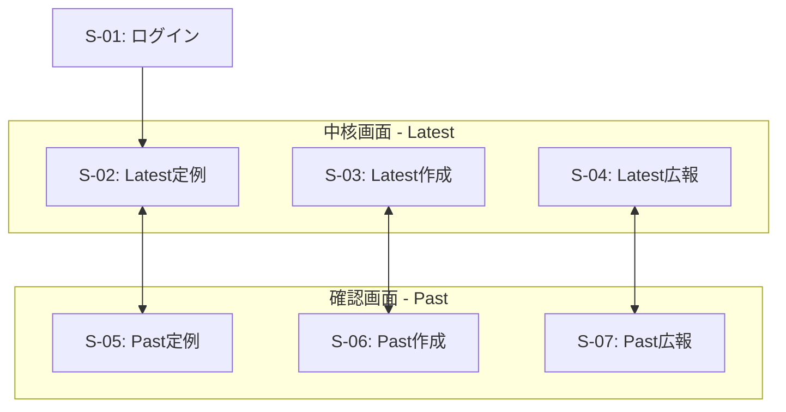
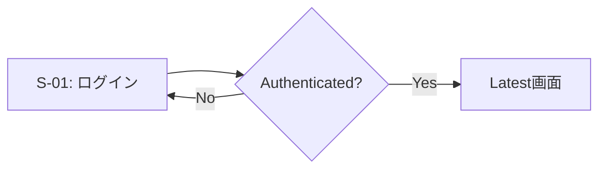
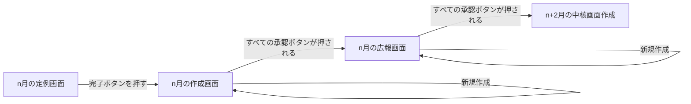
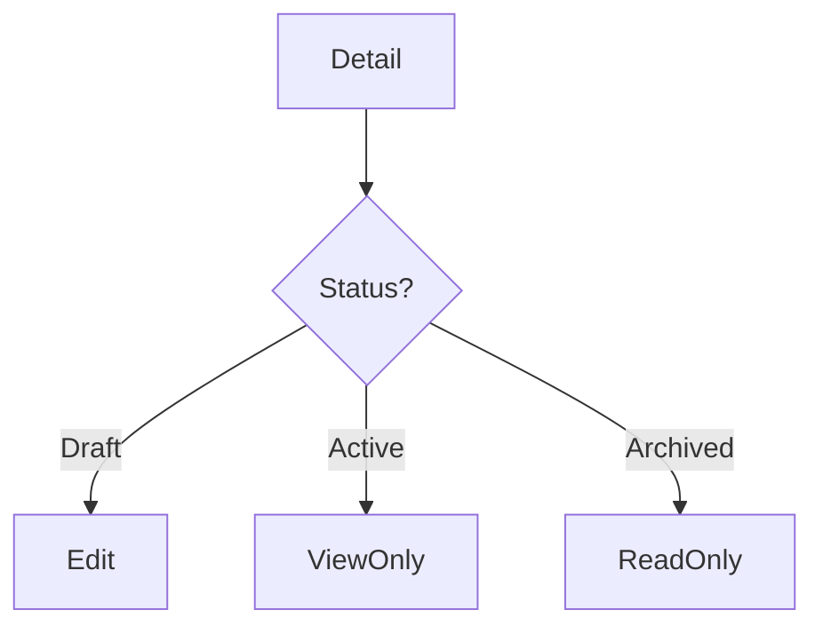
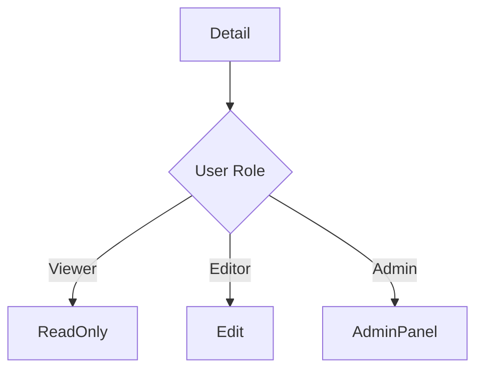
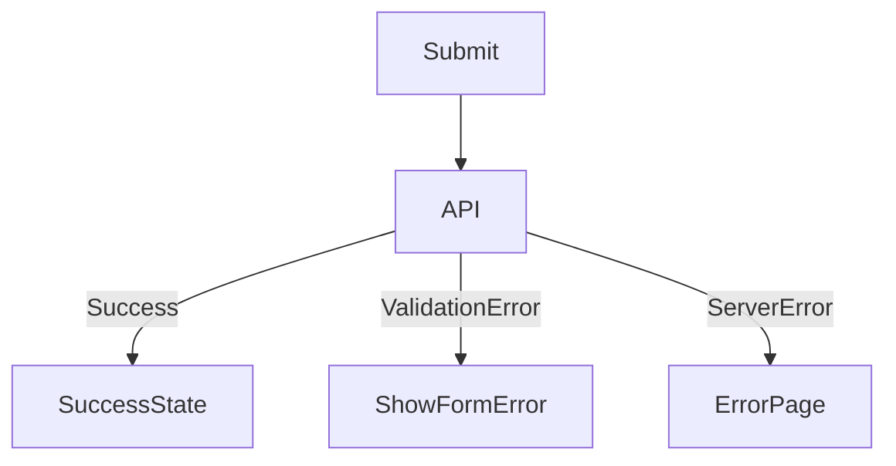
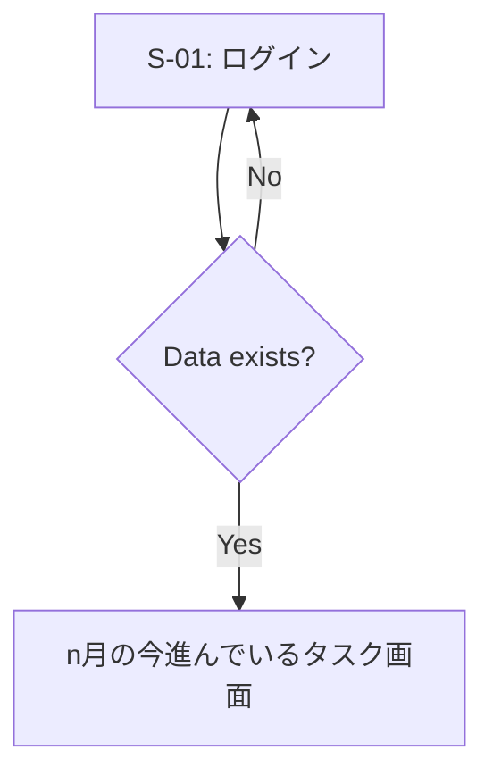

# 🖥️ 画面遷移設計テンプレート

## 0. 設計前提

| 項目 | 内容 |
| --- | --- |
| 対象ユーザー | StepByCode運営 |
| デバイス | Responsive |
| 認証要否 | 全面認証制 |
| 権限制御 | RBAC |
| MVP範囲 | P0画面のみ |

## 1. 画面一覧（Screen Inventory）

| ID | 画面名 | 役割 | 認証 | 優先度 |
| --- | --- | --- | --- | --- |
| S-01 | ログイン | 認証 | 必須 | P0 |
| S-02 | Latest定例 | 中核画面（定例） | 必須 | P1 |
| S-03 | Latest作成 | 中核画面（作成） | 必須 | P0 |
| S-04 | Latest広報 | 中核画面（広報） | 必須 | P1 |
| S-05 | Past定例 | 確認画面（定例） | 必須 | P2 |
| S-06 | Past作成 | 確認画面（作成） | 必須 | P2 |
| S-07 | Past広報 | 確認画面（広報） | 必須 | P2 |

## 2. 全体遷移図（高レベル）

## 3. 認証フロー

## 4. CRUD標準遷移テンプレ

## 5. 状態別分岐（State-based Flow）

## 6. 権限別分岐（RBAC/ABAC）

## 7. エラーフロー

## 8. 空状態 / 初回体験

## 9. モバイル考慮（任意）

| 項目 | Desktop | Mobile |
| --- | --- | --- |
| ナビゲーション | Sidebar | ハンバーガーメニュー |
| 詳細表示 | 2カラム | 1カラム |
| 新規作成 | ページ遷移なし | なし（閲覧専用） |

## 10. URL設計テンプレ

- `/login`
- `/dashboard`
- `/dashboard/yyyy/mm`
- `/create/yyyy/mm`
- `/meeting/yyyy/mm`
- `/influence/yyyy/mm`
