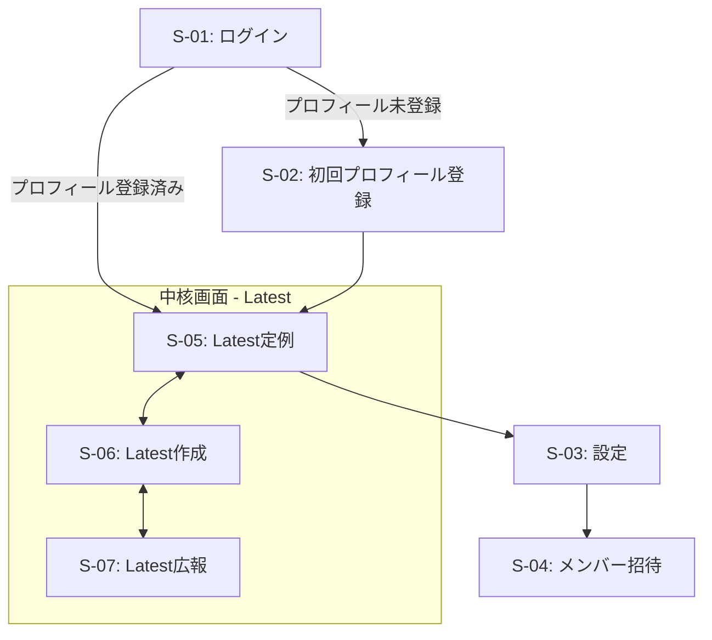
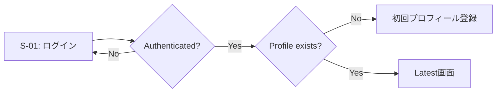
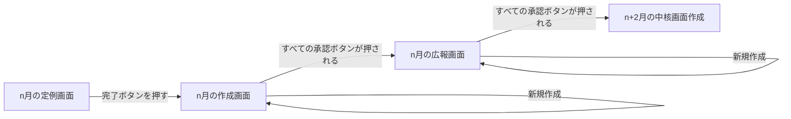
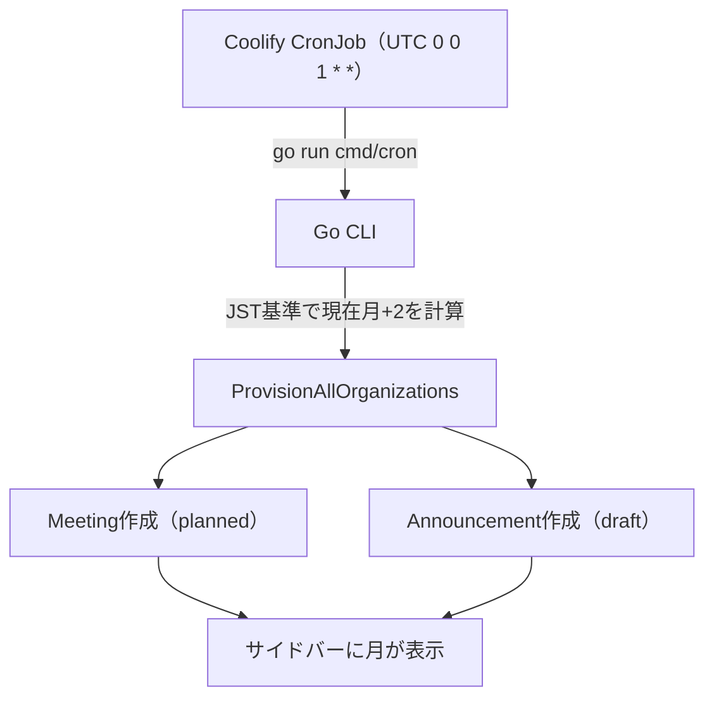
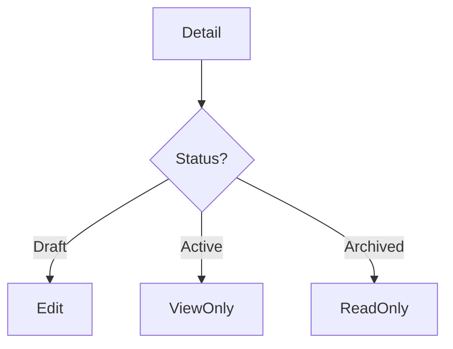
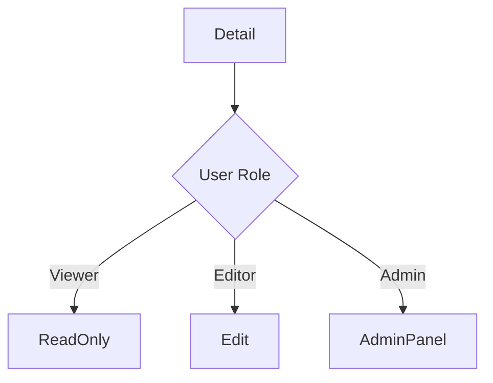
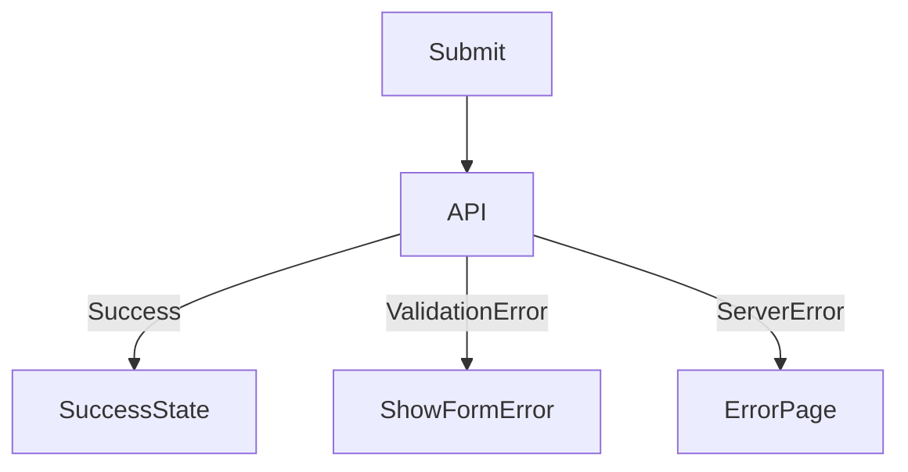
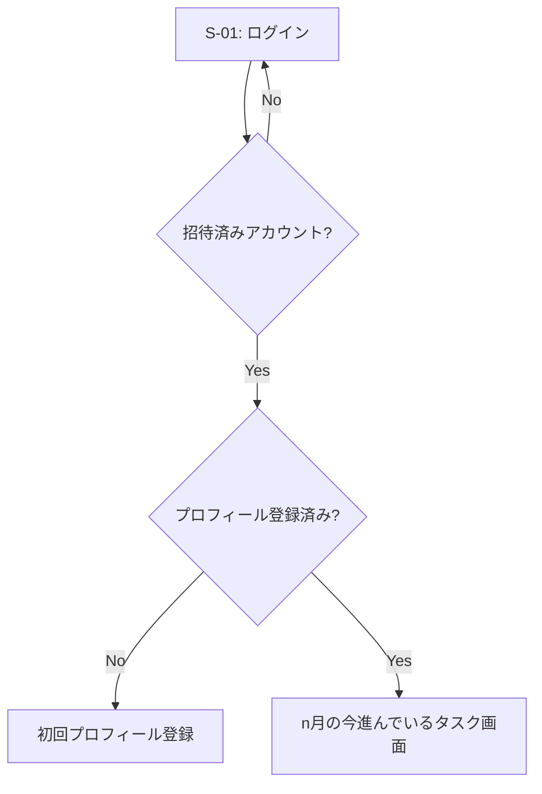

# 🖥️ 画面遷移設計テンプレート

## 0. 設計前提

| 項目 | 内容 |
| --- | --- |
| 対象ユーザー | StepByCode運営 |
| デバイス | Responsive |
| 認証要否 | 全面認証制 |
| 権限制御 | RBAC |
| MVP範囲 | P0画面のみ |

## 1. 画面一覧（Screen Inventory）

| ID | 画面名 | 役割 | 認証 | 優先度 |
| --- | --- | --- | --- | --- |
| S-01 | ログイン | 認証 | 必須 | P0 |
| S-02 | 初回プロフィール登録 | 初回ログイン後のプロフィール設定 | 必須 | P0 |
| S-03 | 設定 | 自分のプロフィール確認・招待導線 | 必須 | P1 |
| S-04 | メンバー招待 | 既存メンバーによるアカウント発行 | 必須 | P1 |
| S-05 | Latest定例 | 中核画面（定例） | 必須 | P1 |
| S-06 | Latest作成 | 中核画面（作成） | 必須 | P0 |
| S-07 | Latest広報 | 中核画面（広報） | 必須 | P1 |

## 2. 全体遷移図（高レベル）

```mermaid
flowchart TD
    S01["S-01: ログイン"]
    S02["S-02: 初回プロフィール登録"]
    S03["S-03: 設定"]
    S04["S-04: メンバー招待"]

    subgraph Core["中核画面 - Latest"]
        S05["S-05: Latest定例"]
        S06["S-06: Latest作成"]
        S07["S-07: Latest広報"]
    end

    S01 -->|"プロフィール未登録"| S02
    S01 -->|"プロフィール登録済み"| S05
    S02 --> S05
    S05 --> S03
    S03 --> S04
    S05 <--> S06
    S06 <--> S07
```

## 3. 認証フロー

```mermaid
flowchart LR
    S01["S-01: ログイン"] --> AuthCheck{"Authenticated?"}
    AuthCheck -- No --> S01
    AuthCheck -- Yes --> ProfileCheck{"Profile exists?"}
    ProfileCheck -- No --> S02["初回プロフィール登録"]
    ProfileCheck -- Yes --> Latest["Latest画面"]
```

## 4. CRUD標準遷移テンプレ

```mermaid
flowchart LR
    S02["n月の定例画面"] -->|"完了ボタンを押す"| S03["n月の作成画面"]
    S03 -->|"すべての承認ボタンが押される"| S04["n月の広報画面"]
    S03 -->|"新規作成"| S03
    S04 -->|"すべての承認ボタンが押される"| N2["n+2月の中核画面作成"]
    S04 -->|"新規作成"| S04
```

## 4.1. 月次発行フロー（Go CLI CronJob）

毎月1日にCoolify CronJobでGo CLIが実行され、2ヶ月先の月のワークフロー期間を自動プロビジョニングする。
サーバーはUTCだが、Go CLI内部でJST変換して正しい月を判定する。

例: JST 12月1日に実行 → 2月分のワークフロー期間（定例・作成・広報ページ）が生成される。

```mermaid
flowchart TD
    Cron["Coolify CronJob（UTC 0 0 1 * *）"] -->|"go run cmd/cron"| CLI["Go CLI"]
    CLI -->|"JST基準で現在月+2を計算"| Provision["ProvisionAllOrganizations"]
    Provision --> Meeting["Meeting作成（planned）"]
    Provision --> Announcement["Announcement作成（draft）"]
    Meeting --> Sidebar["サイドバーに月が表示"]
    Announcement --> Sidebar
```

サイドバーの月リストは `GET /api/v1/workflow-periods` から動的に取得される。
ユーザーは月を選択して、各月の定例・作成・広報を管理できる。

## 5. 状態別分岐（State-based Flow）

```mermaid
flowchart TD
    Detail["Detail"] --> StatusCheck{"Status?"}
    StatusCheck -->|"Draft"| Edit["Edit"]
    StatusCheck -->|"Active"| ViewOnly["ViewOnly"]
    StatusCheck -->|"Archived"| ReadOnly["ReadOnly"]
```

## 6. 権限別分岐（RBAC/ABAC）

```mermaid
flowchart TD
    Detail["Detail"] --> RoleCheck{"User Role"}
    RoleCheck -->|"Viewer"| ReadOnly["ReadOnly"]
    RoleCheck -->|"Editor"| Edit["Edit"]
    RoleCheck -->|"Admin"| AdminPanel["AdminPanel"]
```

## 7. エラーフロー

```mermaid
flowchart TD
    Submit["Submit"] --> API["API"]
    API -->|"Success"| SuccessState["SuccessState"]
    API -->|"ValidationError"| ShowFormError["ShowFormError"]
    API -->|"ServerError"| ErrorPage["ErrorPage"]
```

## 8. 空状態 / 初回体験

```mermaid
flowchart TD
    S01["S-01: ログイン"] --> HasAccount{"招待済みアカウント?"}
    HasAccount -->|"No"| S01
    HasAccount -->|"Yes"| HasProfile{"プロフィール登録済み?"}
    HasProfile -->|"No"| S02["初回プロフィール登録"]
    HasProfile -->|"Yes"| CurrentTask["n月の今進んでいるタスク画面"]
```

## 9. モバイル考慮（任意）

| 項目 | Desktop | Mobile |
| --- | --- | --- |
| ナビゲーション | Sidebar | ハンバーガーメニュー |
| 詳細表示 | 2カラム | 1カラム |
| 新規作成 | ページ遷移なし | なし（閲覧専用） |

## 10. URL設計テンプレ

- `/login`
- `/profile-setup`
- `/settings`
- `/invite`
  - 招待済みメンバー一覧では **自分自身の招待取り消しは不可**（UIでボタン無効化し、APIでも拒否）
- `/`
- `/meeting`
- `/task-create`
- 作成画面では `イベント名` `connpassURL` `Place` を固定タスクとして保持する
- `/publicity`
