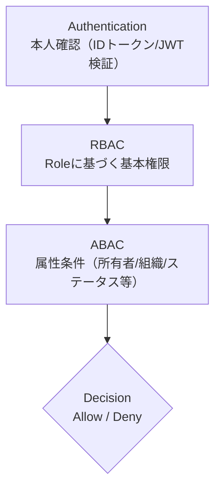

# 🔐 権限設計

## 0. 設計前提

| 項目 | 内容 |
| --- | --- |
| 権限モデル | RBAC |
| マルチテナント | あり |
| 認証方式 | JWT |
| スコープ単位 | Organization |
| MVP方針 | P0は最小ロールのみ |

## 1. 用語定義

| 用語 | 意味 |
| --- | --- |
| Subject | 操作主体（ユーザー / サービスアカウント / システム） |
| Resource | 操作対象となるデータやエンティティ |
| Action | 実行される操作（create / read / update / delete など） |
| Role | 権限を束ねた論理グループ |
| Policy | 条件付きで許可・拒否を定義するルール |

## 2. 権限レイヤー構造



## 3. ロール設計

### 3.1 グローバルロール

| ロール名 | レベル | 説明 |
| --- | ---: | --- |
| SUPER_ADMIN | 100 | 全操作可能（システム管理・ポリシー変更含む） |
| ADMIN | 80 | 管理操作可能（ユーザー管理・設定変更） |
| MEMBER | 50 | 一般利用（通常機能の利用） |
| GUEST | 10 | 閲覧のみ（Read-only） |

### 3.2 スコープロール（組織単位）

※ 本レベルは「組織スコープ内」での相対値（Global Roleのレベルとは別軸）

| ロール名 | レベル | 説明 |
| --- | ---: | --- |
| OWNER | 50 | 組織全権（メンバー管理・設定変更含む） |
| EDITOR | 30 | 編集可（作成/更新/削除。メンバー管理は不可） |
| VIEWER | 10 | 閲覧のみ（Read-only） |

### 3.3 RBAC判定ロジック（抽象）

```text
if user.role.level >= required_level:
    allow
else:
    deny
```

## 4. ABAC設計テンプレ

### 4.1 条件モデル

```json
{
  "subject.role": "EDITOR",
  "subject.tenant_id": "t_123",
  "resource.status": "draft",
  "resource.tenant_id": "t_123",
  "environment.time": "<= deadline"
}
```

### 4.2 ポリシーテーブル

| ID | 名前 | Action | 条件 | Effect | Priority |
| --- | --- | --- | --- | --- | ---: |
| 1 | DraftOnlyEdit | `entity:update` | `status=draft` | allow | 10 |
| 2 | OwnerOverride | `entity:update` | `role=OWNER` | allow | 5 |
| 3 | TenantBoundary | - | `tenant_mismatch` | deny | 1 |

### 4.3 判定順序

1. 認証確認（Authentication）
2. テナント境界（Tenant Boundary）※不一致は即deny
3. RBAC判定（Role Level）
4. ABAC条件評価（Priority順 / deny優先）
5. 最終Decision（allow/deny + 監査ログ）

## 5. ハイブリッド設計パターン

| レイヤー | 用途 |
| --- | --- |
| RBAC | 大枠制御（ロールレベル） |
| ABAC | 状態・所有者・時間など動的条件 |
| Feature Flag | 実験的制御（段階リリース / ABテスト） |

## 6. 代表的ルールテンプレ

### 6.1 所有者のみ編集可

```text
if resource.owner_id == user.id:
    allow
```

### 6.2 ステータスロック

```text
if resource.status == "confirmed":
    deny update
```

### 6.3 テナント境界

```text
if resource.tenant_id != user.tenant_id:
    deny
```

### 6.4 自分のデータのみ閲覧

```text
if resource.user_id == user.id:
    allow
```

## 7. データモデル連携テンプレ

| ルール | 参照カラム |
| --- | --- |
| 所有者制御 | `entity.owner_id` |
| 状態制御 | `entity.status` |
| テナント制御 | `entity.tenant_id` |
| 組織制御 | `group_members` |

## 8. ログ設計

### 8.1 ABAC評価ログ

| フィールド | 内容 |
| --- | --- |
| `user_id` | - |
| `action` | - |
| `resource_type` | - |
| `resource_id` | - |
| `matched_policy` | - |
| `result` | allow / deny |
| `timestamp` | - |

### 8.2 監査ログ

| フィールド | 内容 |
| --- | --- |
| who | user |
| what | action |
| where | resource |
| result | decision |
| ip | client_ip |

## 9. APIレイヤー統合

```javascript
function authorize(user, action, resource) {
  if (!isAuthenticated(user)) throw 401
  if (!tenantMatch(user, resource)) throw 403
  if (!rbacAllow(user, action)) throw 403
  if (!abacAllow(user, action, resource)) throw 403
}
```

## 10. フロントエンド制御

| パターン | 説明 |
| --- | --- |
| 非表示 | ボタンを出さない |
| 無効化 | `disabled` 表示 |
| 警告 | `warn` 表示 |

※ フロントはUX制御のみ。最終判定は必ずサーバー側で行う。
