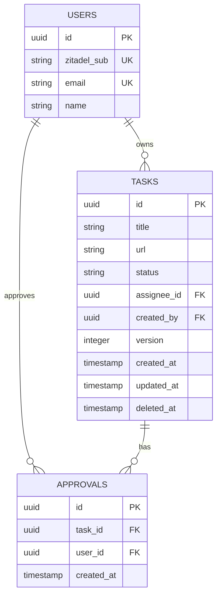
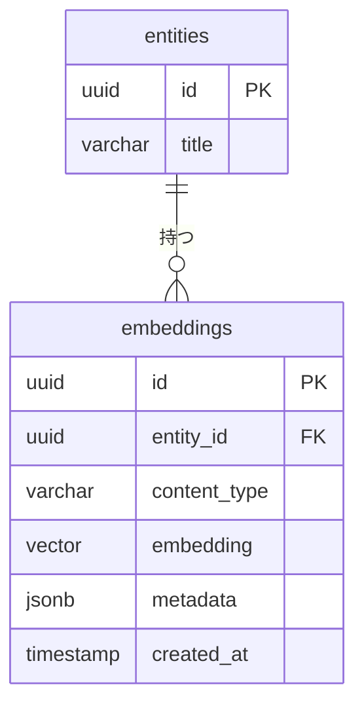
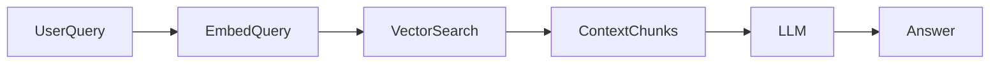

# 🗄️ DB設計書テンプレート

## 0. 設計観点

| 項目 | 内容 |
| --- | --- |
| 権限モデル | RBAC |
| ID戦略 | Auto Increment |
| 論理削除 | 無 |
| 監査ログ | 必須 |

## 1. テーブル一覧テンプレート

### 1.1 最小構成（MVP）

| ドメイン | テーブル名 | 役割 | Phase |
| --- | --- | --- | --- |
| アカウント | users | ユーザー主体 | P0 |
| コア機能 | tasks | 中核リソース | P0 |
| コア機能 | approvals | 関係テーブル | P0 |
| 拡張 | custom_attributes | 拡張属性 | P2 |

### 1.2 標準構成（拡張）

| ドメイン | テーブル名 | 役割 | Phase |
| --- | --- | --- | --- |
| アカウント | users | ユーザー主体 | P0 |
| 認可 | roles | ロール定義 | P0 |
| 認可 | user_roles | ロール付与 | P0 |
| コア機能 | entities | 中核リソース | P0 |
| コア機能 | entity_relations | 関係テーブル | P1 |
| 補助 | comments | コメント | P1 |
| 補助 | logs | 操作ログ | P0 |
| 通知 | notifications | 通知管理 | P1 |
| 拡張 | custom_attributes | 拡張属性 | P2 |
| 監査 | audit_logs | 監査ログ | P0 |

## 2. ERDテンプレート（抽象版）



## 3. カラム定義テンプレート

### 3.1 `users`

| カラム | 型 | 制約 | 説明 |
| --- | --- | --- | --- |
| id | UUID | PK | - |
| zitadel_sub | String | UNIQUE NOT NULL | - |
| email | String | UNIQUE NOT NULL | - |
| name | String | NOT NULL | - |

### 3.2 `tasks`

| カラム | 型 | 制約 | 説明 |
| --- | --- | --- | --- |
| id | UUID | PK | - |
| title | String | UNIQUE NOT NULL | - |
| url | String | UNIQUE NOT NULL | - |
| status | Enum | NOT NULL | in progress / done |
| assignee_id (FK) | UUID | - | `users.id` |
| created_by (FK) | UUID | NOT NULL | `users.id` |
| version | Integer | DEFAULT 1 | - |
| created_at | Timestamp | DEFAULT now() | - |
| updated_at | Timestamp | DEFAULT now() | - |
| deleted_at | Timestamp | - | - |

### 3.3 `approvals`

| カラム | 型 | 制約 | 説明 |
| --- | --- | --- | --- |
| id (PK) | UUID | NOT NULL | - |
| task_id (FK) | UUID | NOT NULL | - |
| user_id (FK) | UUID | NOT NULL | - |
| created_at | Timestamp | DEFAULT now() | - |
| unique_key | - | `(task_id, user_id)` | 複合ユニーク |

## 4. 権限設計テンプレート

### 4.1 RBAC

- `role.level` 比較で許可判定

### 4.2 ABAC（任意）

```json
{
  "subject.role": "EDITOR",
  "resource.status": "active",
  "environment.time": "<= deadline"
}
```

### 4.3 関連テーブル

| テーブル | 役割 |
| --- | --- |
| policies | 条件定義 |
| policy_logs | 評価ログ |

## 5. 🧠 ベクトルDB設計テンプレート

### 5.1 アーキテクチャ選択パターン

#### A. 同一DB内（pgvector）

```text
App
 └── PostgreSQL (RDB + Vector)
```

- メリット: トランザクション整合性、シンプル
- デメリット: 大規模時のスケール制限

#### B. 外部ベクトルDB分離

```text
App
 ├── RDB（メタデータ）
 └── Vector DB（検索専用）
```

- メリット: 高速検索・水平スケール、フィルタリング最適化
- デメリット: 整合性管理が必要

### 5.2 ベクトル格納設計パターン

#### パターン1: 既存テーブルに直接保持（小規模向け）

```sql
ALTER TABLE entities
ADD COLUMN embedding VECTOR(1536);
```

適用条件:
- 1エンティティ = 1ベクトル
- 更新頻度が低い

#### パターン2: 専用ベクトルテーブル（推奨）



`embeddings` テーブル定義:

| カラム | 型 | 説明 |
| --- | --- | --- |
| id | UUID | PK |
| entity_id | UUID | 紐づくリソース |
| content_type | VARCHAR | title/body/comment 等 |
| embedding | VECTOR(N) | ベクトル |
| metadata | JSONB | フィルタ用属性 |
| model_name | VARCHAR | 使用モデル |
| created_at | TIMESTAMP | - |

## 6. 検索設計テンプレート

### 6.1 メタデータ設計（検索フィルタ用）

```json
{
  "group_id": "uuid",
  "status": "active",
  "visibility": "public",
  "language": "ja",
  "created_by": "uuid"
}
```

※ RAGやマルチテナントでは必須。

### 6.2 インデックス設計

pgvector（Cosine距離）:

```sql
CREATE INDEX idx_embeddings_vector
ON embeddings
USING ivfflat (embedding vector_cosine_ops)
WITH (lists = 100);
```

HNSW（高速）:

```sql
CREATE INDEX idx_embeddings_hnsw
ON embeddings
USING hnsw (embedding vector_cosine_ops);
```

### 6.3 クエリテンプレ（類似検索 TopK）

```sql
SELECT entity_id, 1 - (embedding <=> :query_vector) AS similarity
FROM embeddings
WHERE metadata->>'group_id' = :group_id
ORDER BY embedding <=> :query_vector
LIMIT 10;
```

### 6.4 更新戦略テンプレ

| 戦略 | 説明 |
| --- | --- |
| 同期更新 | レコード保存時に即生成 |
| 非同期キュー | 保存→Job→生成 |
| 再生成バッチ | モデル変更時に全更新 |

## 7. RAG設計テンプレ



### 7.1 チャンク設計指針

| 項目 | 推奨 |
| --- | --- |
| 文字数 | 300〜800 tokens |
| オーバーラップ | 10〜20% |
| 単位 | 意味単位（段落） |

### 7.2 多ベクトル対応

用途別に分ける:

| 種類 | 例 |
| --- | --- |
| semantic_vector | 本文検索 |
| keyword_vector | タイトル重視 |
| user_profile_vector | レコメンド |
| skill_vector | マッチング |

```sql
vector_semantic VECTOR(1536),
vector_title VECTOR(1536)
```
