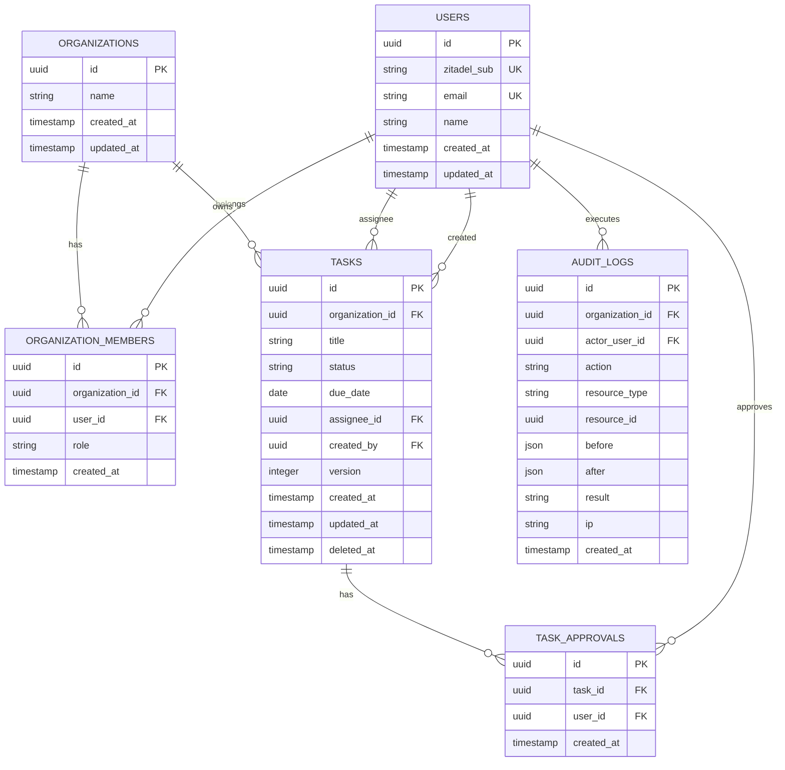

# 🗄️ DB設計書

## 0. 設計観点

| 項目 | 内容 |
| --- | --- |
| 権限モデル | RBAC + ABAC |
| ID戦略 | UUID |
| 論理削除 | あり（主に `tasks.deleted_at`） |
| 監査ログ | 必須 |
| マルチテナント | `organizations` を境界とする |

## 1. テーブル一覧

### 1.1 MVP（P0）

| ドメイン | テーブル名 | 役割 | Phase |
| --- | --- | --- | --- |
| アカウント | `users` | 運営メンバー主体 | P0 |
| 組織 | `organizations` | 組織スコープ境界 | P0 |
| 組織 | `organization_members` | 組織内ロール付与 | P0 |
| コア機能 | `tasks` | 進捗管理の中核リソース | P0 |
| コア機能 | `task_approvals` | タスク承認の関係テーブル | P0 |
| 監査 | `audit_logs` | 操作監査ログ | P0 |

### 1.2 拡張（P1〜）

| ドメイン | テーブル名 | 役割 | Phase |
| --- | --- | --- | --- |
| コア機能 | `meetings` | 定例情報 | P1 |
| コア機能 | `announcements` | 広報文面・投稿履歴 | P1 |
| 補助 | `attachments` | ファイル参照 | P2 |

## 2. ERD（MVP）



## 3. 主要テーブル定義

### 3.1 `users`

| カラム | 型 | 制約 | 説明 |
| --- | --- | --- | --- |
| `id` | UUID | PK | ユーザーID |
| `zitadel_sub` | TEXT | UNIQUE NOT NULL | OIDCのsubject |
| `email` | TEXT | UNIQUE NOT NULL | メールアドレス |
| `name` | TEXT | NOT NULL | 表示名 |
| `created_at` | TIMESTAMP | NOT NULL | 作成日時 |
| `updated_at` | TIMESTAMP | NOT NULL | 更新日時 |

### 3.2 `tasks`

| カラム | 型 | 制約 | 説明 |
| --- | --- | --- | --- |
| `id` | UUID | PK | タスクID |
| `organization_id` | UUID | FK NOT NULL | `organizations.id` |
| `title` | TEXT | NOT NULL | タイトル |
| `status` | TEXT | NOT NULL | `todo/in_progress/done` |
| `due_date` | DATE | NULL | 締切 |
| `assignee_id` | UUID | FK NULL | `users.id` |
| `created_by` | UUID | FK NOT NULL | `users.id` |
| `version` | INT | NOT NULL DEFAULT 1 | 楽観ロック用 |
| `created_at` | TIMESTAMP | NOT NULL | 作成日時 |
| `updated_at` | TIMESTAMP | NOT NULL | 更新日時 |
| `deleted_at` | TIMESTAMP | NULL | 論理削除 |

### 3.3 `task_approvals`

| カラム | 型 | 制約 | 説明 |
| --- | --- | --- | --- |
| `id` | UUID | PK | 承認ID |
| `task_id` | UUID | FK NOT NULL | `tasks.id` |
| `user_id` | UUID | FK NOT NULL | `users.id` |
| `created_at` | TIMESTAMP | NOT NULL | 承認日時 |

補足:
- `UNIQUE(task_id, user_id)` を設定し、二重承認を防止する

## 4. インデックス方針

| テーブル | インデックス | 目的 |
| --- | --- | --- |
| `tasks` | `(organization_id, status, due_date)` | 一覧検索の最適化 |
| `tasks` | `(assignee_id, status)` | 担当者別の未完了取得 |
| `task_approvals` | `(task_id)` | 承認状態参照 |
| `audit_logs` | `(organization_id, created_at)` | 監査追跡 |

## 5. マイグレーション運用

- 変更は `up` / `down` の対で作成する
- 破壊的変更（列削除・型変更）は2段階リリースで実施する
- 本番適用前にバックアップ取得を必須とする

## 6. SQLサンプル

### 6.1 未完了タスク一覧

```sql
SELECT id, title, status, due_date
FROM tasks
WHERE organization_id = $1
  AND deleted_at IS NULL
  AND status IN ('todo', 'in_progress')
ORDER BY due_date NULLS LAST, created_at DESC;
```

### 6.2 承認済み人数付きタスク

```sql
SELECT
  t.id,
  t.title,
  COUNT(a.id) AS approval_count
FROM tasks t
LEFT JOIN task_approvals a ON a.task_id = t.id
WHERE t.organization_id = $1
  AND t.deleted_at IS NULL
GROUP BY t.id, t.title
ORDER BY t.created_at DESC;
```

## 7. 更新ルール

- テーブル追加・変更時はこのファイルと `doc/04_permission-design.md` を同時更新する
- APIのレスポンス変更がある場合は `doc/03_screen-flow.md` の影響範囲も確認する
