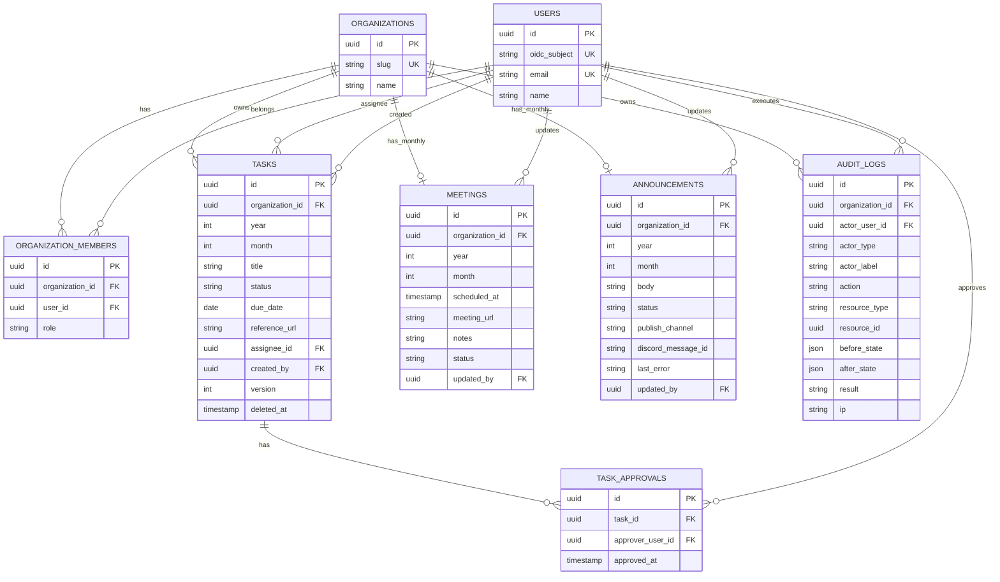

# DB設計書

## 0. 設計観点

| 項目 | 内容 |
| --- | --- |
| 権限モデル | `organization_members` を正本とする RBAC |
| ID 戦略 | UUID |
| 論理削除 | `tasks.deleted_at` |
| 監査ログ | 必須 |
| 月次管理 | `year` / `month` カラム |
| 認証主体 | `users.oidc_subject` |

## 1. テーブル一覧

| テーブル | 役割 | Phase |
| --- | --- | --- |
| `users` | 認証主体 | P0 |
| `organizations` | 組織境界 | P0 |
| `organization_members` | 組織ロール | P0 |
| `tasks` | 月次作成タスク | P0 |
| `task_approvals` | 複数承認者の未承認/承認済み状態 | P0 |
| `meetings` | 月次定例情報 | P1 |
| `announcements` | 広報下書き・投稿状態 | P1 |
| `audit_logs` | 監査ログ | P0 |

## 2. ERD


```mermaid
erDiagram
    ORGANIZATIONS ||--o{ ORGANIZATION_MEMBERS : has
    USERS ||--o{ ORGANIZATION_MEMBERS : belongs

    ORGANIZATIONS ||--o{ TASKS : owns
    USERS ||--o{ TASKS : assignee
    USERS ||--o{ TASKS : created
    TASKS ||--o{ TASK_APPROVALS : has
    USERS ||--o{ TASK_APPROVALS : approves

    ORGANIZATIONS ||--o| MEETINGS : has_monthly
    USERS ||--o{ MEETINGS : updates

    ORGANIZATIONS ||--o| ANNOUNCEMENTS : has_monthly
    USERS ||--o{ ANNOUNCEMENTS : updates

    ORGANIZATIONS ||--o{ AUDIT_LOGS : owns
    USERS ||--o{ AUDIT_LOGS : executes

    ORGANIZATIONS {
        uuid id PK
        string slug UK
        string name
    }

    USERS {
        uuid id PK
        string oidc_subject UK
        string email UK
        string name
    }

    ORGANIZATION_MEMBERS {
        uuid id PK
        uuid organization_id FK
        uuid user_id FK
        string role
    }

    TASKS {
        uuid id PK
        uuid organization_id FK
        int year
        int month
        string title
        string status
        date due_date
        string reference_url
        uuid assignee_id FK
        uuid created_by FK
        int version
        timestamp deleted_at
    }

    TASK_APPROVALS {
        uuid id PK
        uuid task_id FK
        uuid approver_user_id FK
        timestamp approved_at
    }

    MEETINGS {
        uuid id PK
        uuid organization_id FK
        int year
        int month
        timestamp scheduled_at
        string meeting_url
        string notes
        string status
        uuid updated_by FK
    }

    ANNOUNCEMENTS {
        uuid id PK
        uuid organization_id FK
        int year
        int month
        string body
        string status
        string publish_channel
        string discord_message_id
        string last_error
        uuid updated_by FK
    }

    AUDIT_LOGS {
        uuid id PK
        uuid organization_id FK
        uuid actor_user_id FK
        string actor_type
        string actor_label
        string action
        string resource_type
        uuid resource_id
        json before_state
        json after_state
        string result
        string ip
    }
```

## 3. 主要テーブル定義

### 3.1 `users`

| カラム | 型 | 制約 | 説明 |
| --- | --- | --- | --- |
| `id` | UUID | PK | ユーザー ID |
| `oidc_subject` | TEXT | UNIQUE NOT NULL | Pocket ID / stub の subject |
| `email` | TEXT | UNIQUE NOT NULL | 表示メール |
| `name` | TEXT | NOT NULL | 表示名 |

### 3.2 `organization_members`

| カラム | 型 | 制約 | 説明 |
| --- | --- | --- | --- |
| `organization_id` | UUID | FK NOT NULL | 組織境界 |
| `user_id` | UUID | FK NOT NULL | 対象ユーザー |
| `role` | TEXT | CHECK | `OWNER / EDITOR / VIEWER` |

### 3.3 `tasks`

| カラム | 型 | 制約 | 説明 |
| --- | --- | --- | --- |
| `organization_id` | UUID | FK NOT NULL | 組織境界 |
| `year` | INT | NOT NULL | 対象年 |
| `month` | INT | NOT NULL | 対象月 |
| `title` | TEXT | NOT NULL | タスク名 |
| `status` | TEXT | CHECK | `todo / in_progress / done` |
| `due_date` | DATE | NULL | 締切 |
| `reference_url` | TEXT | NULL | 参照 URL |
| `assignee_id` | UUID | FK NULL | 担当者 |
| `created_by` | UUID | FK NOT NULL | 作成者 |
| `version` | INT | NOT NULL | 楽観ロック |
| `deleted_at` | TIMESTAMP | NULL | 論理削除 |

### 3.4 `task_approvals`

| カラム | 型 | 制約 | 説明 |
| --- | --- | --- | --- |
| `task_id` | UUID | FK NOT NULL | 対象タスク |
| `approver_user_id` | UUID | FK NOT NULL | 承認者 |
| `approved_at` | TIMESTAMP | NULL | 承認済みなら値が入る |

補足:
- `UNIQUE(task_id, approver_user_id)` を持つ
- `approved_at IS NULL` が未承認状態

### 3.5 `meetings`

| カラム | 型 | 制約 | 説明 |
| --- | --- | --- | --- |
| `organization_id` | UUID | FK NOT NULL | 組織境界 |
| `year` | INT | NOT NULL | 対象年 |
| `month` | INT | NOT NULL | 対象月 |
| `scheduled_at` | TIMESTAMPTZ | NULL | 開催日時 |
| `meeting_url` | TEXT | NULL | Meet URL |
| `notes` | TEXT | NULL | 補足 |
| `status` | TEXT | CHECK | `planned / completed / cancelled` |

### 3.6 `announcements`

| カラム | 型 | 制約 | 説明 |
| --- | --- | --- | --- |
| `organization_id` | UUID | FK NOT NULL | 組織境界 |
| `year` | INT | NOT NULL | 対象年 |
| `month` | INT | NOT NULL | 対象月 |
| `body` | TEXT | NOT NULL | 広報本文 |
| `status` | TEXT | CHECK | `draft / publish_requested / published / publish_failed` |
| `publish_channel` | TEXT | NULL | Bot 投稿先 |
| `discord_message_id` | TEXT | NULL | 投稿成功後のメッセージ ID |
| `last_error` | TEXT | NULL | 失敗時のメッセージ |

### 3.7 `audit_logs`

| カラム | 型 | 制約 | 説明 |
| --- | --- | --- | --- |
| `organization_id` | UUID | FK NOT NULL | 組織境界 |
| `actor_user_id` | UUID | FK NULL | user actor の場合のみ設定 |
| `actor_type` | TEXT | NOT NULL | `user / service` |
| `actor_label` | TEXT | NULL | service 名など |
| `action` | TEXT | NOT NULL | `task.update` など |
| `before_state` | JSONB | NULL | 変更前 |
| `after_state` | JSONB | NULL | 変更後 |

## 4. インデックス方針

| テーブル | インデックス | 目的 |
| --- | --- | --- |
| `tasks` | `(organization_id, year, month, status)` | 月次一覧 |
| `tasks` | `(assignee_id, status)` | 担当者別参照 |
| `task_approvals` | `(task_id)` | 承認集計 |
| `meetings` | `(organization_id, year, month)` | 月次取得 |
| `announcements` | `(organization_id, year, month)` | 月次取得 |
| `audit_logs` | `(organization_id, created_at DESC)` | 監査追跡 |

## 5. SQL サンプル

### 5.1 月次タスク一覧

```sql
SELECT *
FROM tasks
WHERE organization_id = $1
  AND year = $2
  AND month = $3
  AND deleted_at IS NULL
ORDER BY created_at DESC;
```

### 5.2 月次タスクの承認進捗

```sql
SELECT
  t.id,
  COUNT(ta.id) AS approver_count,
  COUNT(ta.id) FILTER (WHERE ta.approved_at IS NOT NULL) AS approved_count
FROM tasks t
LEFT JOIN task_approvals ta ON ta.task_id = t.id
WHERE t.organization_id = $1
  AND t.year = $2
  AND t.month = $3
  AND t.deleted_at IS NULL
GROUP BY t.id;
```
