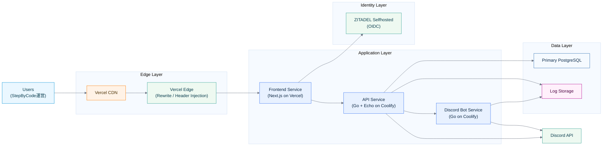

# Infrastructure Guidelines

## System Architecture

## System Components

### 1. Edge Layer

#### CDN / Edge Network

- 静的アセット配信
- TLS終端
- キャッシュ制御

#### Edge Functions

- ヘッダー注入
- リライト
- 早期リジェクト（未認証アクセス）

### 2. Application Layer

#### Frontend Service

- Next.js on Vercel
- 認証フローの起点
- API呼び出しと画面描画

#### API Service

- Go + Echo
- ビジネスロジック
- 認可の最終判定
- DB永続化

#### Discord Bot Service

- 定例/締切通知
- Discord API連携
- API連携によるステータス通知

### 3. Identity Layer

- ZITADEL Selfhosted（OIDC）
- JWT発行とユーザー同定
- 将来のIdP差し替えを想定した分離

### 4. Data Layer

| コンポーネント | 用途 |
| --- | --- |
| PostgreSQL | トランザクションデータ |
| Log Storage | アプリ・監査ログ保存 |

## Environment Strategy

| 環境 | 用途 | デプロイ |
| --- | --- | --- |
| `dev` | 開発・検証 | 手動/ブランチ単位 |
| `staging` | 結合確認 | main反映前 |
| `prod` | 本番運用 | 承認後自動反映 |

## Security Baseline

- 通信はHTTPS（TLS1.2+）を強制
- APIはJWT検証を必須化
- テナント境界（organization_id）を全クエリで担保
- 監査対象操作を `audit_logs` に記録

## Scaling / Reliability

- Frontend: CDNキャッシュで配信最適化
- API: Coolify側で水平スケール可能な構成を維持
- DB: read-heavy化したらRead Replicaを検討
- 障害時: APIとBotはログを最優先で保全

## Monitoring

- アプリログ: 失敗率・5xx率・処理時間
- インフラ: CPU/Memory/再起動回数
- アラート: 高優先度は即時通知（Discord/メール）

## Release Policy

1. `doc/` で設計変更を先に確定
2. 実装PRでテストとドキュメントを同時更新
3. `staging` で確認後に `prod` へ反映
