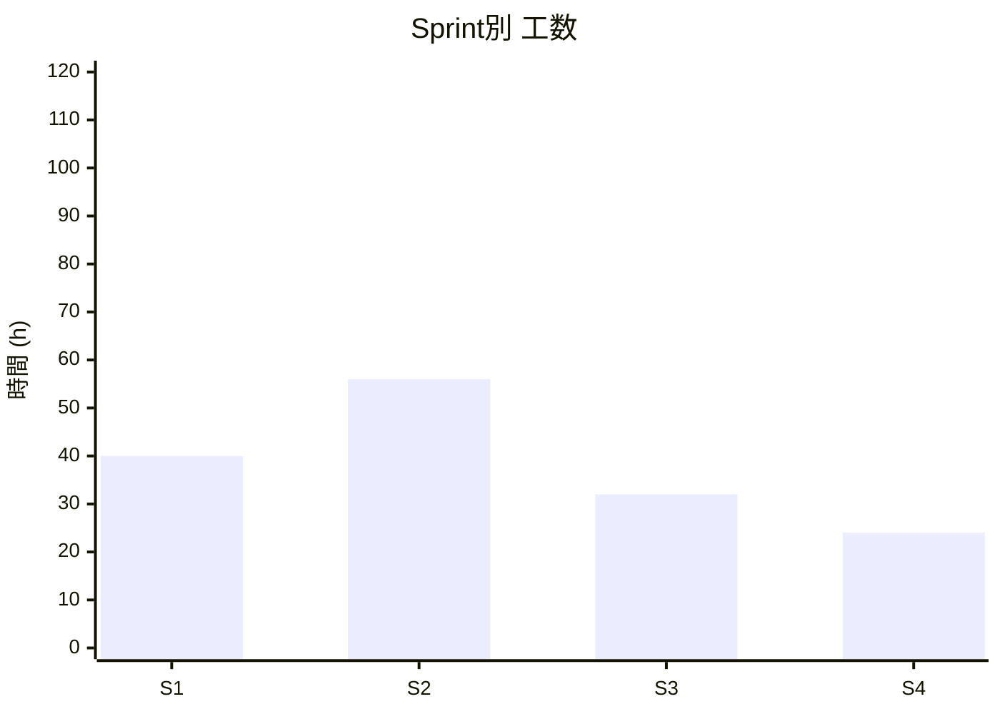
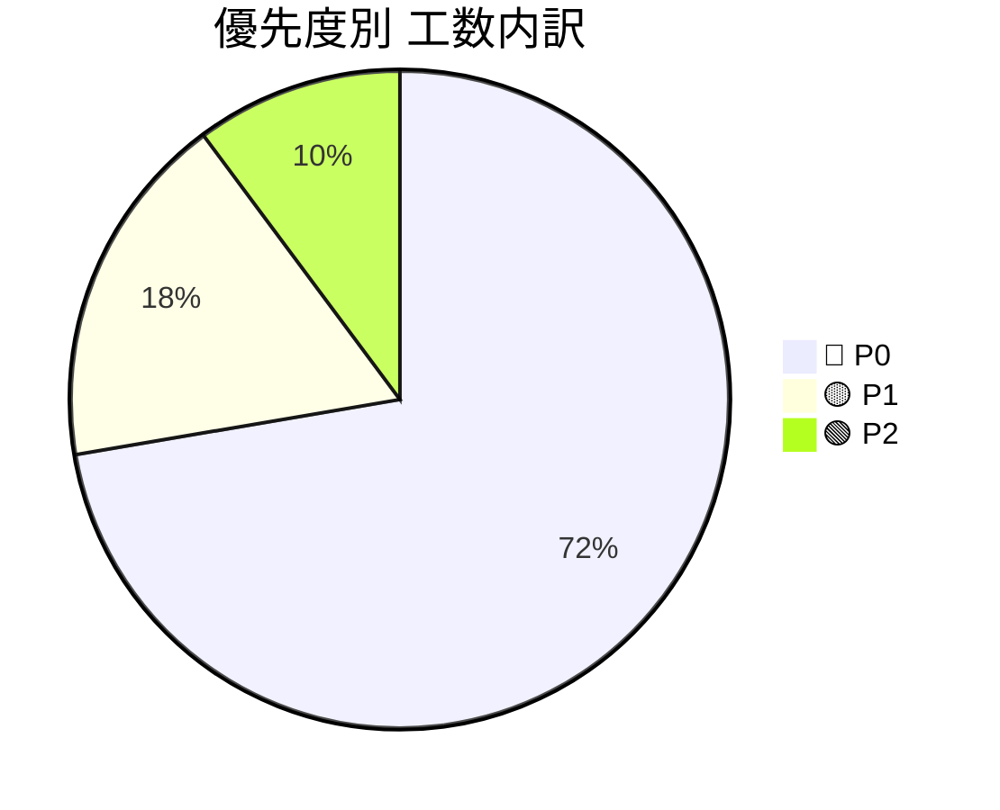

# 🚀 プロジェクトIssue管理（工数見積もり付き）

## 0. 前提条件

- 1人日 = 8時間
- 想定チーム規模: 3名（スキル混在）

### 見積単位

| ラベル | 工数 |
| --- | --- |
| XS | 2h |
| S | 3h |
| M | 5h |
| L | 7h |
| XL | 11h以上 |

### 優先度ラベル

- 🔴 P0: MVP必須
- 🟡 P1: 早期追加
- 🟢 P2: 中期対応
- ⚪ P3: 将来構想

## 1. 体制

- A: きど（BE）
- B: なかい（FE）
- C: たかの（FE）

## 2. 3月スケジュール（サマリー）

| 週 | A | B | C | 補足 |
| --- | --- | --- | --- | --- |
| 1週目 | ○ | △ | ○ | 基盤準備 |
| 2週目 | ○ | ○ | ○ | P0実装開始 |
| 3週目 | ○ | △ | ○ | 結合・修正 |
| 4週目 | ○ | ○ | △ | P1着手 |

凡例:
- `○`: 作業可能（5時間）
- `△`: 作業可能（2〜3時間）
- `×`: 作業不可

## 3. Sprint別Issue

### Sprint 1: インフラ

| # | タイトル | 工数 | 優先度 | 担当 | 備考 |
| --- | --- | --- | --- | --- | --- |
| C-3 | OIDC基盤（ZITADEL） | L | 🔴 P0 | A | 認証基盤 |
| C-1 | Frontendサービス初期構築 | M | 🟡 P1 | B | Vercel |
| C-2 | APIサービス初期構築 | M | 🟡 P1 | A | Coolify |

### Sprint 2: コア機能（P0）

| # | タイトル | 工数 | 優先度 | 担当 | 備考 |
| --- | --- | --- | --- | --- | --- |
| B-1 | タスク新規作成（テンプレート化） | XL | 🔴 P0 | B | UI/API連携 |
| B-2 | タスク確認（未完了/完了） | M | 🔴 P0 | B | 一覧表示 |

### Sprint 3: 結合

| # | タイトル | 工数 | 優先度 | 担当 | 備考 |
| --- | --- | --- | --- | --- | --- |
| INT-1 | Frontend/API結合 | L | 🔴 P0 | A,B | OpenAPI準拠 |
| INT-2 | 認可・監査ログ統合 | M | 🔴 P0 | A | RBAC検証 |

### Sprint 4: 機能追加

| # | タイトル | 工数 | 優先度 | 担当 | 備考 |
| --- | --- | --- | --- | --- | --- |
| B-3 | 広報文章作成支援 | L | 🟡 P1 | C | テンプレート機能 |
| B-4/C-4 | 定例情報確認（Bot連携） | L | 🟢 P2 | A,C | Discord連携 |

## 4. 工数サマリー

### Sprint別工数（例）

### 優先度別内訳（例）

## 5. クリティカルパス（例）

```mermaid
gantt
    title 主要Issue 工数
    dateFormat X
    axisFormat %s h

    section 基盤
    OIDC基盤 :0, 16
    API初期構築 :0, 16

    section コア機能
    API開発 :crit, 16, 24
    UI開発 :crit, 16, 24

    section 結合
    結合テスト :crit, 40, 16
```

## 6. 見積もり計算式

`総工数 ÷ (人数 × 1日8h × 週5日)`

例:

`316h ÷ (4人 × 40h/週) = 約2週間`

レビュー・テスト込みでは `×1.3〜1.5` を推奨。

## 7. 運用ルール

1. 全Issueを洗い出してから優先度を付与する
2. MVPはP0のみでスプリントを切る
3. 外部依存（OIDC/API連携）は20〜30%のバッファを確保する
4. 仕様変更が出たら同スプリント内で再見積もりする
