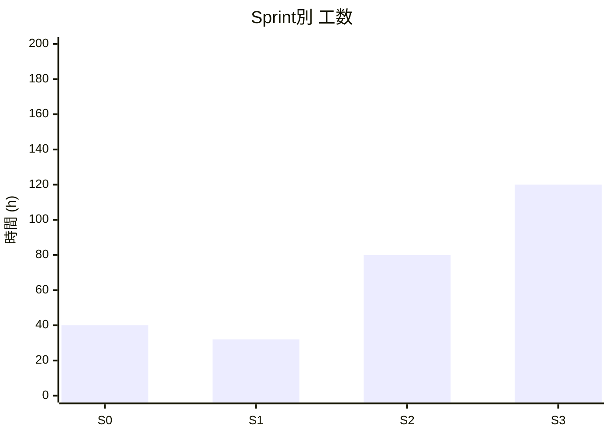
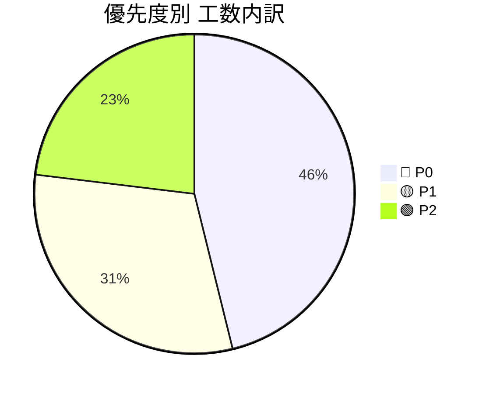
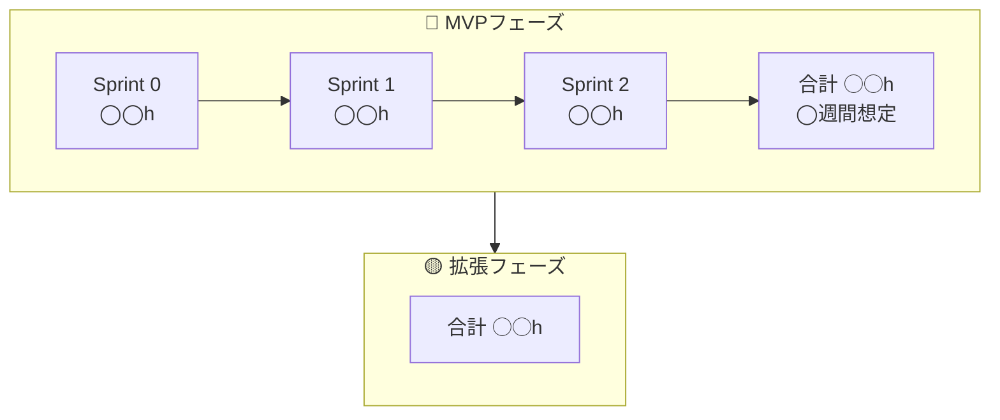

# 🚀 プロジェクトIssue管理テンプレート（工数見積もり付き）

## 📌 前提条件

- 1人日 = 8時間
- 想定チーム規模: 3名（例: 3〜8名、スキル混在）

見積単位:

| ラベル | 工数 |
| --- | --- |
| XS | 2h |
| S | 3h |
| M | 5h |
| L | 7h |
| XL | 11h以上 |

優先度ラベル:

- 🔴 P0: MVP必須
- 🟡 P1: 早期追加
- 🟢 P2: 中期対応
- ⚪ P3: 将来構想

## 3月スケジュール

担当:
- A: きど（BE）
- B: なかい（FE）
- C: たかの（FE）

凡例:

| 記号 | 内容 |
| --- | --- |
| ○ | 作業可能（5時間） |
| △ | 作業可能（2〜3時間） |
| × | 作業不可 |

| 日 | A | B | C |
| ---: | --- | --- | --- |
| 1 | ⚪︎ | △ | ○ |
| 2 | ⚪︎ | △ | × |
| 3 | ⚪︎ | △ | ○ |
| 4 | ⚪︎ | △ | ○ |
| 5 | ⚪︎× | △ | ○ |
| 6 | ⚪︎ | ⚪︎ | ○ |
| 7 | ⚪︎ | × | × |
| 8 | ⚪︎ | △ | × |
| 9 | ⚪︎○ | ○ | × |
| 10 | ⚪︎○ | ○ | ○ |
| 11 | ⚪︎○ | × | ○ |
| 12 | ⚪︎○ | ○ | ○ |
| 13 | ⚪︎○ | × | △ |
| 14 | ⚪︎○ | × | × |
| 15 | ⚪︎○ | × | × |
| 16 | ○ | △ | ○ |
| 17 | ○ | ○ | ○ |
| 18 | ○ | △ | ○ |
| 19 | ○ | ○ | ○ |
| 20 | ○ | △ | × |
| 21 | ○ | ⚪︎ | × |
| 22 | ○ | △ | × |
| 23 | ○ | ○ | × |
| 24 | ○ | △ | × |
| 25 | ○ | △ | ○ |
| 26 | ⚪︎ | × | ○ |
| 27 | ○ | ○ | ○ |
| 28 | - | - | - |
| 29 | - | - | - |
| 30 | - | - | - |
| 31 | - | - | - |

## 🏁 Sprint別 Issue一覧テンプレート

### 🏗️ Sprint 1: インフラ

🔢 推定合計: ◯◯h

| # | タイトル | 工数 | 時間 | 優先度 | 担当 | 備考 |
| --- | --- | --- | --- | --- | --- | --- |
| #A1,C3 | OIDC基盤 | - | - | 🔴 P0 | BE | - |
| #C1 | FEサービス | - | - | 🟡 P1 | BE | - |
| #C2 | BEサービス | - | - | 🟡 P1 | BE | - |
| Sprint合計 | - | - | ◯◯h | - | - | - |
| （P0のみ） | - | - | ◯◯h | - | - | - |

### 🏗️ Sprint 2: コア機能（mock）

🔢 推定合計: ◯◯h

| # | タイトル | 工数 | 時間 | 優先度 | 担当 | 備考 |
| --- | --- | --- | --- | --- | --- | --- |
| #B1 | タスク新規作成（テンプレート化） | XL | 20h | 🔴 P0 | FE | - |
| #B2 | タスク確認 | S | 3h | 🔴 P0 | FE | - |
| Sprint合計 | - | - | 23h | - | - | - |
| （P0のみ） | - | - | 23h | - | - | - |

### 🏗️ Sprint 3: 1,2の繋ぎこみ

🔢 推定合計: ◯◯h

| # | タイトル | 工数 | 時間 | 優先度 | 担当 | 備考 |
| --- | --- | --- | --- | --- | --- | --- |
| #B1 | - | - | - | 🔴 P0 | BE | - |
| #B2 | - | - | - | 🔴 P0 | BE | - |
| Sprint合計 | - | - | ◯◯h | - | - | - |
| （P0のみ） | - | - | ◯◯h | - | - | - |

### 🏗️ Sprint 4: 機能追加

🔢 推定合計: ◯◯h

| # | タイトル | 工数 | 時間 | 優先度 | 担当 | 備考 |
| --- | --- | --- | --- | --- | --- | --- |
| #B3 | 広報文章作成 | L | 7h | 🟡 P1 | FE | - |
| #A2,B4,C4 | 定例情報確認（Discord botサービス） | - | - | 🟢 P2 | FE・BE | - |
| Sprint合計 | - | - | ◯◯h | - | - | - |
| （P0のみ） | - | - | ◯◯h | - | - | - |

## 📊 工数サマリー

### Sprint別工数

### 優先度別内訳

## 🗓️ フェーズ分解テンプレート

## ⏱️ クリティカルパス可視化テンプレート

```mermaid
gantt
    title 主要Issue 工数
    dateFormat X
    axisFormat %s h

    section 基盤
    #001 基盤構築 :0, 16
    #002 DB設計 :0, 16

    section コア機能
    #010 API開発 :crit, 0, 16
    #011 UI開発 :crit, 0, 24
```

## 📈 規模感サマリー表

| 区分 | Issue数 | 工数合計 | 並行3名想定 | 並行4名想定 |
| --- | --- | --- | --- | --- |
| 🔴 MVP | ◯件 | ◯◯h | ◯週間 | ◯週間 |
| 🟡 P1 | ◯件 | ◯◯h | ◯週間 | ◯週間 |
| 🟢 P2 | ◯件 | ◯◯h | ◯週間 | ◯週間 |
| 合計 | ◯件 | ◯◯h | ◯週間 | ◯週間 |

## 🧮 見積もり計算式（コピー用）

`総工数 ÷ (人数 × 1日8h × 週5日)`

例:

`316h ÷ (4人 × 40h/週) = 約2週間`

※ レビュー・テスト込みなら `×1.3〜1.5` を推奨。

## 🎯 実務で使う際の運用ルール（推奨）

### 1. 見積もり精度向上

- UIはデザイン確定後に再見積
- AI / 外部API依存はバッファ20〜30%確保
- 初心者アサイン時は +30% 補正

### 2. スプリント設計

- MVPは P0のみ抽出
- FE最大工数タスクは早期分解
- API設計 → UI → 結合 の順に並べる

### 3. 並行開発最適化

- BE専任1〜2名を確保
- FEはUI集中Sprintを分離
- Infraは最初に完了させる

## 🔎 使い方まとめ

1. 全Issueを書き出す
2. 工数ラベルを割り当てる
3. P0のみ抽出してMVP期間を算出
4. 1.3倍補正をかけて現実的なスケジュールにする
5. クリティカルパスをMermaidで可視化する
